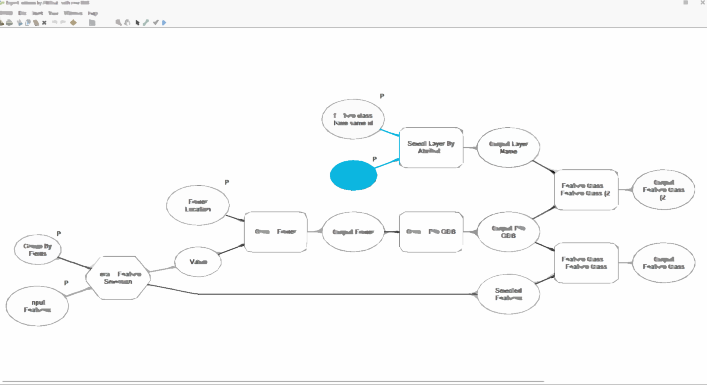

<!-- PROJECT LOGO -->
 

  

  <h3 align="center">AboElmagd modelbuilder box</h3>

  

    model builder to help you automat some tasks
    

<!-- TABLE OF CONTENTS -->

  
Table of Contents

  <ol>
    <li>
       modelbuiders contains on
              <ul>
                <li>Arcpro models</li>
                <li>Collect feature class</li>
                <li>Convert mxd</li>
                <li>cut fill</li>
                <li>cut fill</li>
                <li>digitizing</li>
                <li>Export
                   <ul>  
                     <li>Export features by Attribute with new GDB</li>
                          <li>export to autocade</li>
                         </ul>  
                
        </li>
      
  </ol>

<!-- ABOUT THE PROJECT -->
## About The Project

model builder to help you automat some tasks

Use the `AboElmagd box` to get started.
  

### Built With

This modelbuilder work with arcpro&arcmap 10.4 

<!-- LICENSE -->
## License

License for everyone.

<!-- CONTACT -->
## Contact

my Name - [@mahmoud-aboelmagd](https://github.com/aboelmagd1/) - [LinkedIn](https://www.linkedin.com/in/mahmoud-aboelmagd/) - mahmoudaboelmagdfree@gmail.com

Project Link: [https://github.com/aboelmagd1/modelBuilder](https://github.com/aboelmagd1/modelBuilder)

(<a href="#top">back to top</a>)

